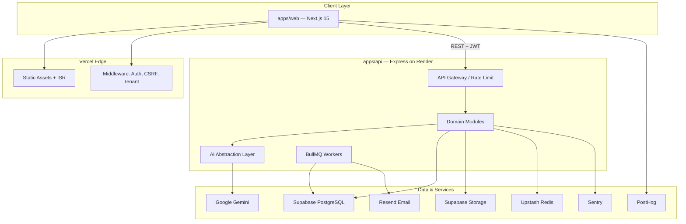
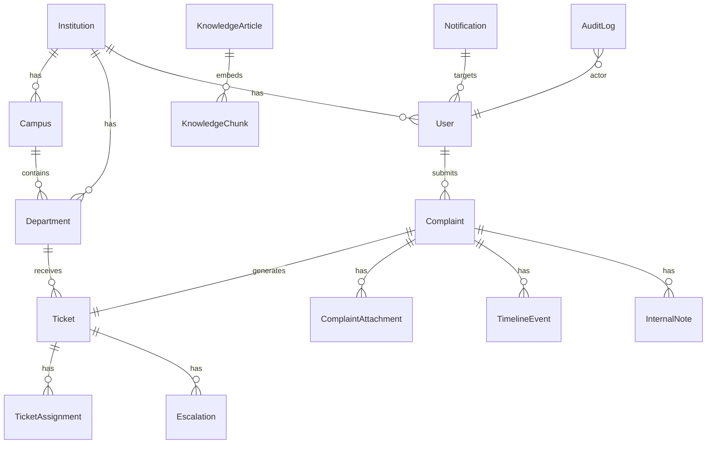
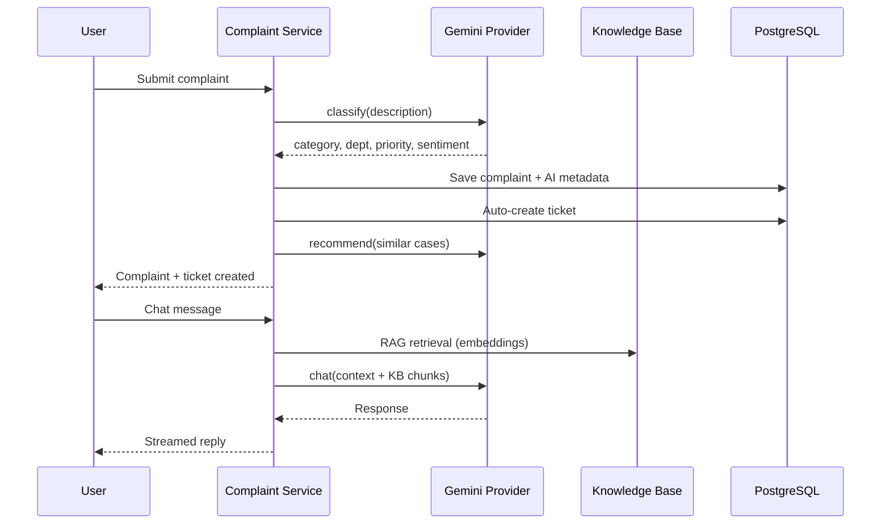
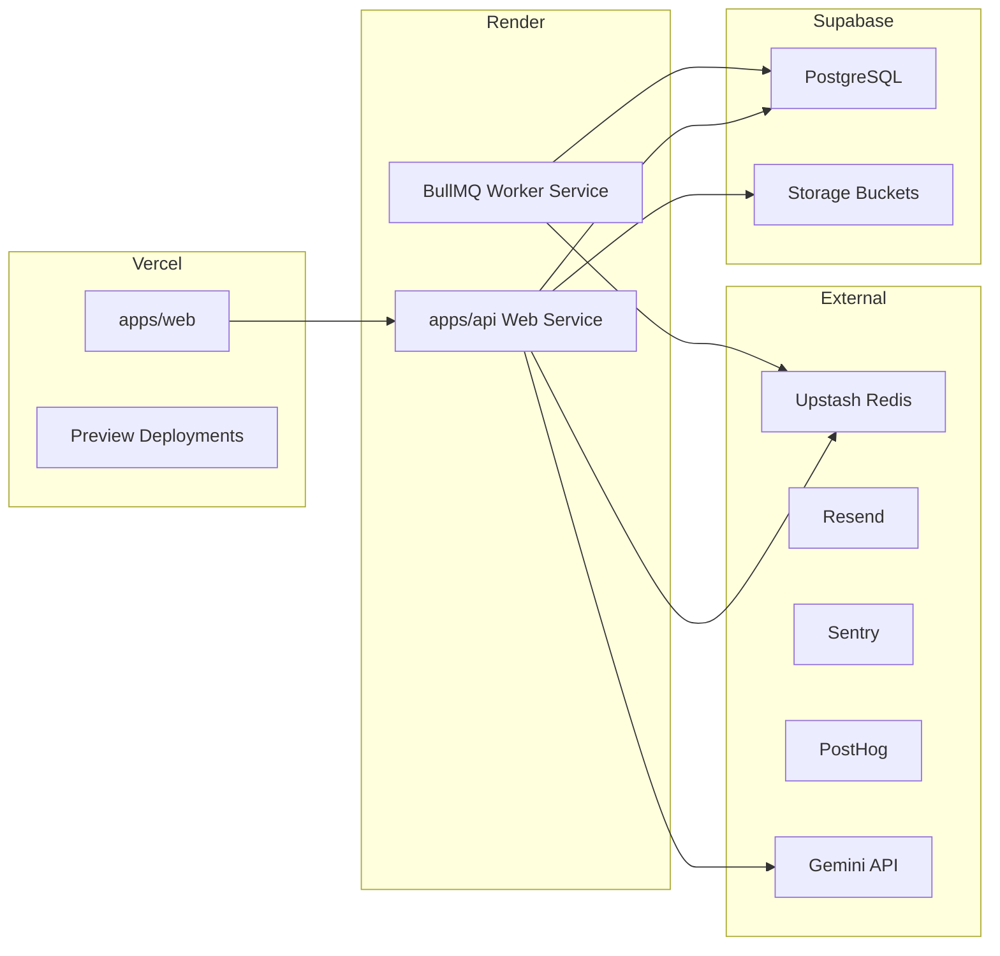

# Clarion SaaS platform architecture and requirements

## User

# Clarion — SYSTEM ARCHITECTURE & IMPLEMENTATION DIRECTIVE

You are acting as a team of:

* Senior Software Architect
* Principal Fullstack Engineer
* AI Engineer
* Product Designer
* DevOps Engineer
* Security Engineer
* Database Architect
* UI/UX Strategist

Your objective is to design and build a production-grade SaaS platform called:

# Clarion

### Tagline

"Smarter Complaint, Report and Issue Resolution for Modern Institutions"

Clarion is an AI-powered complaint, report, issue management, and institutional support platform built specifically for tertiary institutions.

This is NOT a student-level CRUD project.

Build it as if it will be deployed to universities across Africa and support tens of thousands of users.

---

# CORE PROJECT OBJECTIVES

1. Design and develop an AI-enhanced complaint, report, and issue management platform for tertiary institutions.

2. Integrate intelligent technologies such as AI chat assistance, automated complaint classification, smart routing, issue prioritization, and analytics.

3. Improve transparency, accountability, response times, communication, and institutional efficiency.

---

# MANDATORY TECHNOLOGY STACK

Do not substitute technologies.

## Frontend

* Next.js 15+
* React 19+
* TypeScript
* Tailwind CSS
* ShadCN/UI
* Framer Motion
* TanStack Query
* Zustand
* React Hook Form
* Zod

Deployment:

* Vercel

The frontend must be optimized for Vercel deployment.

---

## Backend

* Express.js
* TypeScript
* Prisma ORM
* JWT Authentication
* Refresh Tokens
* RBAC Authorization

Deployment:

* Render

The backend must be fully decoupled from the frontend.

All communication must occur through REST APIs.

---

## Database

* PostgreSQL
* Supabase
* Prisma ORM

Requirements:

* Normalized schema
* Prisma migrations
* Prisma seed scripts
* Soft deletion support
* Audit logging
* Query optimization
* Proper indexing

All database operations must go through Prisma.

---

## AI STACK

### AI Provider

* Gemini
* Google AI Studio

The AI layer must be modular.

Create an abstraction layer so additional providers can be added later.

Example:

```txt
AIProvider
├── GeminiProvider
├── FutureOpenAIProvider
├── FutureClaudeProvider
```

The system should currently use Gemini exclusively.

---

# MONOREPO REQUIREMENT

Use:

* PNPM Workspaces
* Turborepo

Do not use npm workspaces.

Project Structure:

```txt
Clarion/

├── apps/
│
│   ├── web/
│   │
│   ├── api/
│
├── packages/
│
│   ├── database/
│   │
│   ├── shared/
│   │
│   ├── ui/
│   │
│   ├── ai/
│   │
│   └── config/
│
├── docs/
│
├── .github/
│
├── turbo.json
├── pnpm-workspace.yaml
├── package.json
└── README.md
```

---

# FEATURE-BASED BACKEND STRUCTURE

Backend architecture must follow domain separation.

```txt
api/src/modules/

auth/
users/
institutions/
departments/
complaints/
reports/
tickets/
analytics/
notifications/
knowledge-base/
chatbot/
ai/
dashboard/
audit/
settings/
```

Every module must contain:

```txt
controllers/
services/
repositories/
validators/
routes/
types/
dto/
```

Follow:

* Clean Architecture
* SOLID Principles
* Dependency Injection
* Separation of Concerns

---

# MULTI-TENANCY REQUIREMENT

The platform must support:

* Multiple institutions
* Multiple campuses
* Multiple departments

Institution data must be logically isolated.

Even if development starts with one institution, architecture must support SaaS expansion.

---

# USER TYPES

## Student

Can:

* Submit complaints
* Submit reports
* Upload evidence
* Track complaints
* Chat with AI
* View notifications
* Rate resolutions

---

## Lecturer

Can:

* Submit complaints
* Respond to assigned issues
* Participate in resolution workflows

---

## Administrative Staff

Can:

* Manage complaints
* Assign tickets
* Update statuses
* Communicate with users

---

## Department Heads

Can:

* Monitor departmental issues
* Escalate complaints
* Review performance

---

## Institution Management

Can:

* View institution-wide analytics
* Monitor performance
* Generate reports

---

## Super Administrator

Can:

* Manage institutions
* Manage users
* Manage AI settings
* Manage system configuration
* Access audit logs

---

# COMPLAINT MANAGEMENT MODULE

Support:

* Complaint creation
* Complaint categorization
* Evidence uploads
* Complaint timeline
* Internal notes
* Public updates

Statuses:

* Submitted
* Under Review
* Assigned
* In Progress
* Awaiting Information
* Escalated
* Resolved
* Rejected
* Closed

Every action must be stored in a timeline history.

---

# SMART TICKETING SYSTEM

Automatically generate tickets.

Features:

* Unique Ticket IDs
* Department Assignment
* Priority Assignment
* Escalation Rules
* SLA Tracking
* Resolution Tracking

---

# AI MODULE

AI is a first-class feature.

---

## AI Complaint Classification

Automatically determine:

* Complaint category
* Responsible department
* Severity level
* Priority level
* Sentiment score
* Suggested resolution

---

## AI Chat Assistant

Users should be able to ask:

* How to submit complaints
* Complaint status questions
* Institution-related FAQs
* Resolution guidance

The chatbot should use:

* Gemini
* Knowledge Base Retrieval
* Institutional Policies

---

## AI Analytics Engine

Generate:

* Complaint trends
* Department performance
* Emerging issue detection
* Risk prediction
* Recurring complaint patterns

---

## AI Smart Recommendations

Suggest:

* Resolution actions
* Responsible personnel
* Similar historical cases
* Estimated resolution times

---

# KNOWLEDGE BASE

Create a searchable institutional knowledge center.

Support:

* FAQs
* Articles
* Policies
* Guides
* AI-assisted search

---

# NOTIFICATION SYSTEM

Implement:

* In-App Notifications
* Email Notifications
* Real-Time Notifications

Notify users when:

* Complaint is submitted
* Complaint is assigned
* Status changes
* Resolution occurs
* Escalation occurs

---

# FILE MANAGEMENT

Use:

* Supabase Storage

Support:

* Images
* PDFs
* Documents
* Screenshots
* Evidence Files

Requirements:

* File Validation
* Virus Scan Hooks
* Secure Access Policies
* Size Limits

---

# DASHBOARDS

Create dedicated dashboards for:

* Students
* Staff
* Department Heads
* Management
* Super Admin

Each dashboard must display role-specific analytics and actions.

---

# ANALYTICS

Build advanced institutional analytics.

Metrics:

* Resolution Time
* Complaint Volume
* Department Efficiency
* Satisfaction Scores
* Escalation Rates
* AI Insights

Visualize with:

* Interactive Charts
* Trend Graphs
* Activity Reports
* Executive Summaries

---

# SECURITY REQUIREMENTS

Implement:

* RBAC
* JWT Authentication
* Refresh Tokens
* Rate Limiting
* CSRF Protection
* XSS Protection
* Input Sanitization
* Prisma Security Best Practices
* Audit Logs
* Activity Tracking

Every critical action must be auditable.

---

# EXTERNAL SERVICES

## Storage

* Supabase Storage

## Email

* Resend

## Monitoring

* Sentry

## Analytics

* PostHog

## Caching

* Upstash Redis

## Background Jobs

* BullMQ

---

# WEBSITE EXPERIENCE

Create a premium modern SaaS experience.

The platform should feel comparable to:

* Linear
* Notion
* Stripe Dashboard
* Clerk
* Vercel Dashboard

Focus on:

* Performance
* Accessibility
* Mobile Responsiveness
* Elegant Interactions
* Excellent Information Hierarchy

Do not copy any design.

Create a unique and professional institutional experience.

---

# DEVELOPMENT PROCESS

Before implementation:

1. Design complete architecture.
2. Design database schema.
3. Design API specification.
4. Design AI architecture.
5. Design deployment architecture.
6. Design role permissions.
7. Design feature modules.

Only then begin implementation.

Implement features incrementally while maintaining production-quality standards.

Do not generate placeholder systems.

Do not generate mock architecture.

Build a real-world deployable SaaS platform.

## Assistant

I'll explore the workspace to see what's already in place, then map your directive to a concrete architecture and implementation plan.

## Assistant

The Clarion workspace is empty, so this is a greenfield build. Below is a production-grade architecture blueprint aligned with your directive — design first, then incremental implementation.

---

# Clarion — System Architecture Blueprint

## 1. Executive Architecture Overview

Clarion is a **multi-tenant SaaS** with a decoupled **Next.js (Vercel)** frontend and **Express (Render)** backend, sharing types and contracts through a **PNPM + Turborepo** monorepo.



### Monorepo layout

```txt
Clarion/
├── apps/
│   ├── web/                    # Next.js 15, App Router
│   └── api/                    # Express + TypeScript
├── packages/
│   ├── database/               # Prisma schema, migrations, seed, client
│   ├── shared/                 # DTOs, enums, Zod schemas, RBAC constants
│   ├── ui/                     # ShadCN primitives + Clarion design system
│   ├── ai/                     # AIProvider abstraction + Gemini
│   └── config/                 # ESLint, TS, Tailwind presets
├── docs/
│   ├── architecture/
│   ├── api/
│   └── adr/                    # Architecture Decision Records
├── .github/workflows/
├── turbo.json
├── pnpm-workspace.yaml
└── package.json
```

### Package dependency graph

```txt
apps/web  → packages/ui, shared, config
apps/api  → packages/database, shared, ai, config
packages/ai → shared
packages/database → shared (enums only)
```

---

## 2. Multi-Tenancy Model

Use **shared database, shared schema, row-level tenant isolation** via `institutionId` on every tenant-scoped table.

| Layer | Strategy |
|-------|----------|
| Database | `institutionId` + composite indexes on all tenant tables |
| API | Tenant context from JWT claims + middleware enforcement |
| Storage | Bucket paths: `{institutionId}/{entityType}/{entityId}/` |
| AI | Institution-scoped knowledge base + policy context |
| Cache | Keys prefixed: `clarion:{institutionId}:...` |

### Tenant hierarchy

```txt
Institution
├── Campus (optional)
│   └── Department
├── Users (scoped to institution)
├── Complaints / Reports / Tickets
├── Knowledge Base
└── Settings (SLA, escalation, AI config)
```

### Tenant context resolution

1. JWT contains `sub`, `institutionId`, `role`, `permissions[]`
2. Every repository method accepts `TenantContext { institutionId, userId, role }`
3. Prisma middleware or repository base class auto-injects `WHERE institutionId = ?`
4. Super Admin bypasses tenant filter only on explicit `/admin/*` routes

---

## 3. Database Schema (Prisma)

### Core design principles

- Normalized 3NF with strategic denormalization for analytics
- `deletedAt` soft delete on user-facing entities
- `AuditLog` for all critical mutations
- `TimelineEvent` for complaint/ticket history
- UUID primary keys (`@default(uuid())`)
- Composite indexes: `(institutionId, status)`, `(institutionId, departmentId, createdAt)`

### Entity relationship (high level)



### Key models (abbreviated)

```prisma
// packages/database/prisma/schema.prisma

enum UserRole {
  STUDENT
  LECTURER
  ADMIN_STAFF
  DEPT_HEAD
  INSTITUTION_MGMT
  SUPER_ADMIN
}

enum ComplaintStatus {
  SUBMITTED
  UNDER_REVIEW
  ASSIGNED
  IN_PROGRESS
  AWAITING_INFORMATION
  ESCALATED
  RESOLVED
  REJECTED
  CLOSED
}

enum TicketPriority {
  LOW
  MEDIUM
  HIGH
  CRITICAL
}

enum TicketSeverity {
  MINOR
  MODERATE
  MAJOR
  CRITICAL
}

model Institution {
  id          String    @id @default(uuid())
  name        String
  slug        String    @unique
  domain      String?   @unique
  logoUrl     String?
  settings    Json      @default("{}")
  isActive    Boolean   @default(true)
  createdAt   DateTime  @default(now())
  updatedAt   DateTime  @updatedAt
  deletedAt   DateTime?

  campuses      Campus[]
  departments   Department[]
  users         User[]
  complaints    Complaint[]
  knowledgeBase KnowledgeArticle[]
}

model Campus {
  id             String   @id @default(uuid())
  institutionId  String
  name           String
  code           String
  institution    Institution @relation(fields: [institutionId], references: [id])
  departments    Department[]
  @@unique([institutionId, code])
  @@index([institutionId])
}

model Department {
  id             String   @id @default(uuid())
  institutionId  String
  campusId       String?
  name           String
  code           String
  headUserId     String?
  slaHours       Int      @default(72)
  institution    Institution @relation(fields: [institutionId], references: [id])
  campus         Campus?  @relation(fields: [campusId], references: [id])
  tickets        Ticket[]
  @@unique([institutionId, code])
  @@index([institutionId, campusId])
}

model User {
  id             String    @id @default(uuid())
  institutionId  String?   // null only for SUPER_ADMIN
  email          String
  passwordHash   String
  firstName      String
  lastName       String
  role           UserRole
  departmentId   String?
  studentId      String?   // matric number
  isActive       Boolean   @default(true)
  lastLoginAt    DateTime?
  createdAt      DateTime  @default(now())
  updatedAt      DateTime  @updatedAt
  deletedAt      DateTime?

  institution    Institution? @relation(fields: [institutionId], references: [id])
  refreshTokens  RefreshToken[]
  complaints     Complaint[]  @relation("SubmittedBy")
  assignments    TicketAssignment[]

  @@unique([institutionId, email])
  @@index([institutionId, role])
}

model Complaint {
  id              String          @id @default(uuid())
  institutionId   String
  referenceNumber String          // CLN-2026-00001
  title           String
  description     String
  status          ComplaintStatus @default(SUBMITTED)
  categoryId      String?
  submitterId     String
  campusId        String?
  departmentId    String?
  isAnonymous     Boolean         @default(false)
  sentimentScore  Float?
  aiMetadata      Json?           // classification snapshot
  resolvedAt      DateTime?
  satisfactionRating Int?
  createdAt       DateTime        @default(now())
  updatedAt       DateTime        @updatedAt
  deletedAt       DateTime?

  institution  Institution @relation(fields: [institutionId], references: [id])
  submitter    User        @relation("SubmittedBy", fields: [submitterId], references: [id])
  ticket       Ticket?
  attachments  ComplaintAttachment[]
  timeline     TimelineEvent[]
  internalNotes InternalNote[]

  @@unique([institutionId, referenceNumber])
  @@index([institutionId, status, createdAt])
  @@index([institutionId, departmentId])
  @@index([institutionId, submitterId])
}

model Ticket {
  id              String         @id @default(uuid())
  institutionId   String
  ticketNumber    String         // TKT-2026-00001
  complaintId     String         @unique
  departmentId    String
  priority        TicketPriority @default(MEDIUM)
  severity        TicketSeverity @default(MODERATE)
  slaDeadline     DateTime?
  slaBreached     Boolean        @default(false)
  escalatedAt     DateTime?
  escalatedLevel  Int            @default(0)
  createdAt       DateTime       @default(now())
  updatedAt       DateTime       @updatedAt

  complaint    Complaint  @relation(fields: [complaintId], references: [id])
  department   Department @relation(fields: [departmentId], references: [id])
  assignments  TicketAssignment[]
  escalations  Escalation[]

  @@unique([institutionId, ticketNumber])
  @@index([institutionId, departmentId, priority])
  @@index([institutionId, slaDeadline])
}

model TimelineEvent {
  id            String   @id @default(uuid())
  institutionId String
  complaintId   String
  actorId       String?
  eventType     String   // STATUS_CHANGE, COMMENT, ASSIGNMENT, ESCALATION
  fromStatus    ComplaintStatus?
  toStatus      ComplaintStatus?
  content       String?
  metadata      Json?
  isPublic      Boolean  @default(true)
  createdAt     DateTime @default(now())

  complaint Complaint @relation(fields: [complaintId], references: [id])

  @@index([complaintId, createdAt])
  @@index([institutionId, createdAt])
}

model AuditLog {
  id            String   @id @default(uuid())
  institutionId String?
  actorId       String?
  action        String   // USER_CREATED, COMPLAINT_ASSIGNED, etc.
  entityType    String
  entityId      String
  oldValue      Json?
  newValue      Json?
  ipAddress     String?
  userAgent     String?
  createdAt     DateTime @default(now())

  @@index([institutionId, createdAt])
  @@index([entityType, entityId])
}

model KnowledgeArticle {
  id             String   @id @default(uuid())
  institutionId  String
  title          String
  slug           String
  content        String
  category       String   // FAQ, POLICY, GUIDE
  isPublished    Boolean  @default(false)
  embedding      Unsupported("vector")? // pgvector via Supabase
  createdAt      DateTime @default(now())
  updatedAt      DateTime @updatedAt
  deletedAt      DateTime?

  @@unique([institutionId, slug])
  @@index([institutionId, category])
}

model Notification {
  id             String   @id @default(uuid())
  institutionId  String
  userId         String
  type           String
  title          String
  body           String
  data           Json?
  isRead         Boolean  @default(false)
  createdAt      DateTime @default(now())

  @@index([userId, isRead, createdAt])
}

model RefreshToken {
  id        String   @id @default(uuid())
  userId    String
  tokenHash String   @unique
  expiresAt DateTime
  revokedAt DateTime?
  createdAt DateTime @default(now())
  user      User     @relation(fields: [userId], references: [id])
}
```

### Indexing strategy

| Query pattern | Index |
|---------------|-------|
| Dashboard: open tickets by dept | `(institutionId, departmentId, status)` |
| Student: my complaints | `(institutionId, submitterId, createdAt DESC)` |
| SLA breach monitoring | `(institutionId, slaDeadline) WHERE slaBreached = false` |
| Analytics time-series | Materialized view `complaint_daily_stats` |
| Audit search | `(institutionId, createdAt DESC)` |

---

## 4. RBAC & Permissions

### Permission model

Use **role + granular permissions** stored in `packages/shared/src/rbac/`.

```typescript
// packages/shared/src/rbac/permissions.ts
export const Permissions = {
  COMPLAINT_CREATE: 'complaint:create',
  COMPLAINT_READ_OWN: 'complaint:read:own',
  COMPLAINT_READ_DEPT: 'complaint:read:dept',
  COMPLAINT_READ_ALL: 'complaint:read:all',
  COMPLAINT_ASSIGN: 'complaint:assign',
  COMPLAINT_UPDATE_STATUS: 'complaint:update:status',
  COMPLAINT_ESCALATE: 'complaint:escalate',
  COMPLAINT_INTERNAL_NOTE: 'complaint:internal_note',
  TICKET_MANAGE: 'ticket:manage',
  ANALYTICS_VIEW_DEPT: 'analytics:view:dept',
  ANALYTICS_VIEW_INST: 'analytics:view:inst',
  ANALYTICS_VIEW_SYSTEM: 'analytics:view:system',
  KB_MANAGE: 'kb:manage',
  USER_MANAGE: 'user:manage',
  INSTITUTION_MANAGE: 'institution:manage',
  AI_CONFIG: 'ai:config',
  AUDIT_READ: 'audit:read',
} as const;
```

### Role matrix

| Permission | Student | Lecturer | Admin Staff | Dept Head | Inst Mgmt | Super Admin |
|------------|---------|----------|-------------|-----------|-----------|-------------|
| Submit complaint | ✓ | ✓ | ✓ | ✓ | ✓ | ✓ |
| Read own complaints | ✓ | ✓ | ✓ | ✓ | ✓ | ✓ |
| Read dept complaints | — | assigned | ✓ | ✓ | ✓ | ✓ |
| Read all institution | — | — | ✓ | ✓ | ✓ | ✓ |
| Assign tickets | — | — | ✓ | ✓ | — | ✓ |
| Escalate | — | — | ✓ | ✓ | ✓ | ✓ |
| Internal notes | — | assigned | ✓ | ✓ | ✓ | ✓ |
| Dept analytics | — | — | — | ✓ | ✓ | ✓ |
| Institution analytics | — | — | — | — | ✓ | ✓ |
| Manage institutions | — | — | — | — | — | ✓ |
| Audit logs | — | — | — | — | partial | ✓ |

### Enforcement layers

1. **Route middleware** — `requirePermission('complaint:assign')`
2. **Service layer** — business rules (e.g., only assignee can respond)
3. **Repository layer** — tenant + scope filters
4. **Frontend** — hide UI; never rely on UI alone

---

## 5. Backend Architecture

### Module structure (per domain)

```txt
apps/api/src/modules/complaints/
├── complaints.controller.ts
├── complaints.service.ts
├── complaints.repository.ts
├── complaints.routes.ts
├── complaints.validator.ts
├── complaints.types.ts
├── dto/
│   ├── create-complaint.dto.ts
│   └── update-status.dto.ts
└── index.ts
```

### Clean architecture layers

```txt
HTTP Request
  → Routes (Express Router)
  → Validators (Zod via shared schemas)
  → Controllers (parse req, call service, format response)
  → Services (business logic, orchestration, AI calls)
  → Repositories (Prisma only, tenant-scoped)
  → Database
```

### Dependency injection

Use a lightweight container (`tsyringe` or manual factory pattern):

```typescript
// apps/api/src/container.ts
export const container = {
  complaintService: new ComplaintService(
    new ComplaintRepository(prisma),
    new TicketService(...),
    new AIService(aiProvider),
    new NotificationService(...),
    new AuditService(...)
  ),
};
```

### API response envelope

```typescript
// Success
{ success: true, data: T, meta?: { page, limit, total } }

// Error
{ success: false, error: { code: string, message: string, details?: unknown } }
```

---

## 6. REST API Specification (v1)

Base URL: `https://api.clarion.app/v1`

### Auth

| Method | Endpoint | Description |
|--------|----------|-------------|
| POST | `/auth/register` | Institution-scoped registration |
| POST | `/auth/login` | Returns access + refresh tokens |
| POST | `/auth/refresh` | Rotate refresh token |
| POST | `/auth/logout` | Revoke refresh token |
| POST | `/auth/forgot-password` | Email reset link |
| POST | `/auth/reset-password` | Reset with token |

### Complaints

| Method | Endpoint | Auth |
|--------|----------|------|
| POST | `/complaints` | Student+ |
| GET | `/complaints` | Scoped list |
| GET | `/complaints/:id` | Owner or staff |
| PATCH | `/complaints/:id/status` | Staff |
| POST | `/complaints/:id/attachments` | Owner |
| GET | `/complaints/:id/timeline` | Scoped |
| POST | `/complaints/:id/notes` | Staff (internal) |
| POST | `/complaints/:id/rate` | Owner (resolved) |

### Tickets

| Method | Endpoint | Auth |
|--------|----------|------|
| GET | `/tickets` | Staff+ |
| GET | `/tickets/:id` | Staff+ |
| POST | `/tickets/:id/assign` | Admin+ |
| POST | `/tickets/:id/escalate` | Dept Head+ |

### AI

| Method | Endpoint | Auth |
|--------|----------|------|
| POST | `/ai/classify` | Internal (on complaint create) |
| POST | `/ai/chat` | Authenticated |
| GET | `/ai/recommendations/:complaintId` | Staff |
| GET | `/ai/insights` | Dept Head+ |

### Knowledge Base

| Method | Endpoint | Auth |
|--------|----------|------|
| GET | `/knowledge` | Public within tenant |
| GET | `/knowledge/search?q=` | Authenticated |
| POST | `/knowledge` | KB manage |
| PATCH | `/knowledge/:id` | KB manage |

### Analytics

| Method | Endpoint | Auth |
|--------|----------|------|
| GET | `/analytics/overview` | Role-scoped |
| GET | `/analytics/departments` | Dept Head+ |
| GET | `/analytics/trends` | Inst Mgmt+ |
| GET | `/analytics/sla` | Staff+ |

### Real-time

| Method | Endpoint | Description |
|--------|----------|-------------|
| GET | `/notifications` | Paginated |
| PATCH | `/notifications/:id/read` | Mark read |
| WS/SSE | `/events/stream` | Real-time notifications |

---

## 7. AI Architecture

### Abstraction layer (`packages/ai`)

```typescript
// packages/ai/src/types.ts
export interface AIProvider {
  name: string;
  classify(input: ClassificationInput): Promise<ClassificationResult>;
  chat(input: ChatInput): Promise<ChatResponse>;
  embed(text: string): Promise<number[]>;
  analyzeTrends(data: AnalyticsInput): Promise<InsightResult>;
  recommend(context: RecommendationInput): Promise<RecommendationResult>;
}

// packages/ai/src/providers/gemini.provider.ts
export class GeminiProvider implements AIProvider {
  // Google AI Studio / Gemini API
}

// packages/ai/src/factory.ts
export function createAIProvider(): AIProvider {
  return new GeminiProvider(process.env.GEMINI_API_KEY!);
}
```

### AI flows



### Classification prompt structure

- Institution context (name, departments, policies)
- Complaint text
- Output: strict JSON schema (Zod-validated)
- Fallback: `UNKNOWN` category → manual triage queue

### RAG for chatbot

1. Embed user query via Gemini
2. Vector search `KnowledgeArticle.embedding` (pgvector)
3. Top-k chunks + institution policies injected into system prompt
4. Stream response via SSE

---

## 8. Frontend Architecture (`apps/web`)

### App Router structure

```txt
apps/web/src/
├── app/
│   ├── (marketing)/           # Landing, pricing
│   ├── (auth)/                # Login, register
│   ├── (dashboard)/
│   │   ├── student/
│   │   ├── staff/
│   │   ├── department/
│   │   ├── management/
│   │   └── admin/
│   └── api/                   # BFF routes (CSRF, cookie proxy only)
├── components/
│   ├── ui/                    # Re-exports from packages/ui
│   ├── complaints/
│   ├── tickets/
│   ├── analytics/
│   └── layout/
├── lib/
│   ├── api-client.ts          # TanStack Query fetcher
│   ├── auth.ts
│   └── stores/                # Zustand
├── hooks/
└── types/
```

### State management

| Concern | Tool |
|---------|------|
| Server data | TanStack Query |
| Auth session | Zustand + httpOnly cookies via BFF |
| UI state (modals, filters) | Zustand |
| Forms | React Hook Form + Zod |

### Design system direction

- **Typography**: Distinctive sans (e.g., Geist or Satoshi) + mono for ticket IDs
- **Color**: Deep institutional navy + warm accent (amber/coral) — not generic purple gradients
- **Motion**: Framer Motion for page transitions, timeline reveals, status changes
- **Density**: Linear-inspired compact tables for staff; spacious cards for students
- **Accessibility**: WCAG 2.1 AA, focus rings, semantic HTML, keyboard nav

---

## 9. Cross-Cutting Concerns

### Authentication flow

```txt
Login → API issues accessToken (15m) + refreshToken (7d, httpOnly cookie)
Access token in memory (Zustand) or short-lived cookie
Refresh via /auth/refresh with rotation
Logout revokes refresh token in DB
```

### Security checklist

| Control | Implementation |
|---------|----------------|
| Rate limiting | `express-rate-limit` + Upstash Redis store |
| CSRF | Double-submit cookie on mutating routes |
| XSS | React escaping + CSP headers |
| Input sanitization | Zod + `dompurify` for rich text |
| File upload | MIME whitelist, size cap, signed Supabase URLs |
| SQL injection | Prisma parameterized queries only |
| Audit | `AuditService.log()` in every mutation service |
| Secrets | Render/Vercel env vars, never in repo |

### Notifications

| Channel | Trigger | Implementation |
|---------|---------|----------------|
| In-app | All events | `Notification` table + SSE |
| Email | Assignment, resolution, escalation | BullMQ → Resend |
| Real-time | Status changes | SSE or Supabase Realtime |

### Background jobs (BullMQ)

- `sla-check` — every 15 min, flag breaches
- `escalation-rules` — auto-escalate overdue tickets
- `ai-analytics-batch` — nightly trend analysis
- `email-dispatch` — async email queue
- `embedding-sync` — re-embed knowledge articles

---

## 10. Deployment Architecture



### Environment separation

| Env | Frontend | Backend | Database |
|-----|----------|---------|----------|
| Development | localhost:3000 | localhost:4000 | Supabase dev project |
| Staging | clarion-staging.vercel.app | clarion-api-staging.onrender.com | Supabase staging |
| Production | app.clarion.africa | api.clarion.africa | Supabase prod |

### CI/CD (GitHub Actions via Turborepo)

```yaml
# On PR: lint, typecheck, test, build (turbo)
# On merge to main: deploy web → Vercel, api → Render
# Prisma migrate deploy on Render pre-deploy hook
```

---

## 11. Implementation Phases

Build incrementally — each phase is deployable.

### Phase 0 — Foundation (Week 1–2)
- Monorepo scaffold (PNPM, Turborepo, shared configs)
- Prisma schema + migrations + seed
- Auth module (JWT, refresh, RBAC middleware)
- Basic Express app shell + health check
- Next.js shell + design tokens + auth pages

### Phase 1 — Core Complaint Loop (Week 3–4)
- Complaint CRUD + timeline + attachments (Supabase Storage)
- Auto ticket generation
- Staff assignment + status workflow
- Student dashboard (submit, track, rate)
- Staff dashboard (queue, assign, update)

### Phase 2 — AI Layer (Week 5–6)
- `packages/ai` + Gemini integration
- Classification on submit
- Knowledge base CRUD + embeddings
- AI chat assistant with RAG

### Phase 3 — Notifications & Real-time (Week 7)
- In-app notifications
- Email via Resend + BullMQ
- SSE real-time stream

### Phase 4 — Analytics & Dashboards (Week 8–9)
- Department + institution analytics
- AI insights engine
- Role-specific dashboards
- SLA tracking + escalation rules

### Phase 5 — Enterprise Hardening (Week 10+)
- Audit log UI
- Super admin panel
- Multi-institution onboarding
- Sentry, PostHog, performance tuning
- Security audit + load testing

---

## 12. Key Technical Decisions (ADRs)

| Decision | Choice | Rationale |
|----------|--------|-----------|
| Multi-tenancy | Shared schema + `institutionId` | Cost-effective for African universities; scales to thousands of tenants |
| API style | REST v1 | Spec mandate; simpler ops than GraphQL for mobile clients later |
| Real-time | SSE over WebSockets | Simpler on Render; sufficient for notifications |
| Vector search | pgvector on Supabase | Keeps RAG in same DB; no extra Pinecone cost |
| File storage | Supabase Storage | Mandated; RLS policies per institution |
| ID format | Human-readable refs (`CLN-2026-00001`) | Institutional staff need printable ticket numbers |

---

## 13. What to Build First (Day 1 checklist)

When you switch to **Agent mode**, the recommended bootstrap sequence is:

1. `pnpm init` + `turbo.json` + workspace packages
2. `packages/database` — full Prisma schema from Section 3
3. `packages/shared` — enums, Zod schemas, RBAC map
4. `apps/api` — Express bootstrap, auth module, tenant middleware
5. `apps/web` — Next.js 15, Tailwind, ShadCN, login/register
6. `packages/ai` — provider interface + Gemini stub
7. Seed script with 1 institution, 3 departments, 6 role users
8. First E2E path: **student submits complaint → AI classifies → ticket created → staff sees queue**

---

## Summary

This blueprint gives you:

- **Multi-tenant SaaS** architecture ready for many African universities
- **Normalized Prisma schema** with soft delete, audit, and timeline
- **Modular Express backend** with 15 domain modules
- **Pluggable AI layer** (Gemini now, extensible later)
- **Role-based dashboards** and analytics
- **Production deployment** on Vercel + Render + Supabase
- **Phased delivery** so each sprint ships real value

The workspace is empty today, so implementation starts from Phase 0. If you want me to scaffold the monorepo, Prisma schema, and auth module, switch to **Agent mode** and I can begin building Phase 0 incrementally.

## User

Alright begin phase 0

## Assistant

I'm in **Ask mode**, so I can't create files, run installs, or scaffold the monorepo. Switch to **Agent mode** and say "begin Phase 0" again — I'll implement it directly.

Until then, here's the exact Phase 0 bootstrap plan I'll follow:

---

## Phase 0 — Foundation

**Goal:** A deployable monorepo skeleton with auth, database, and app shells — no complaint features yet.

### Deliverables

| # | Deliverable | Package/App |
|---|-------------|-------------|
| 1 | Monorepo scaffold | Root |
| 2 | Shared configs (ESLint, TS, Tailwind) | `packages/config` |
| 3 | Prisma schema + migrations + seed | `packages/database` |
| 4 | Shared types, enums, Zod, RBAC | `packages/shared` |
| 5 | AI provider interface + Gemini stub | `packages/ai` |
| 6 | ShadCN design system base | `packages/ui` |
| 7 | Express API + auth module | `apps/api` |
| 8 | Next.js 15 app + auth pages | `apps/web` |
| 9 | CI workflow stub | `.github/workflows` |
| 10 | README + env examples | Root |

---

### Step 1 — Root monorepo

```bash
# In Clarion/
pnpm init
# Create pnpm-workspace.yaml, turbo.json, root package.json scripts
```

**Root `package.json` scripts:**
- `dev` → `turbo dev`
- `build` → `turbo build`
- `lint` → `turbo lint`
- `db:migrate` → `pnpm --filter @clarion/database migrate`
- `db:seed` → `pnpm --filter @clarion/database seed`

**`pnpm-workspace.yaml`:**
```yaml
packages:
  - "apps/*"
  - "packages/*"
```

---

### Step 2 — `packages/config`

Shared presets:
- `@clarion/config/eslint`
- `@clarion/config/typescript` (base, nextjs, node)
- `@clarion/config/tailwind`

---

### Step 3 — `packages/database`

Full Prisma schema from the architecture blueprint:
- `Institution`, `Campus`, `Department`, `User`, `RefreshToken`
- `Complaint`, `Ticket`, `TimelineEvent`, `AuditLog` (schema only — no business logic yet)
- Soft delete (`deletedAt`) on tenant-facing models
- Seed: 1 institution, 3 departments, 6 users (one per role)

**Scripts:**
- `migrate dev` / `migrate deploy`
- `db:seed`
- Export `prisma` client singleton

---

### Step 4 — `packages/shared`

```
shared/src/
├── enums/          # UserRole, ComplaintStatus, etc.
├── rbac/           # permissions.ts, rolePermissions.ts
├── schemas/        # Zod: login, register, pagination
├── types/          # ApiResponse, TenantContext, JwtPayload
└── constants/      # API routes, token expiry
```

---

### Step 5 — `packages/ai`

```
ai/src/
├── types.ts        # AIProvider interface
├── providers/
│   └── gemini.provider.ts   # stub returning mock classification
└── factory.ts      # createAIProvider()
```

---

### Step 6 — `packages/ui`

- Tailwind + ShadCN init
- Base components: `Button`, `Input`, `Card`, `Label`, `Form`
- Clarion tokens: navy primary, warm accent

---

### Step 7 — `apps/api`

```
api/src/
├── index.ts
├── app.ts
├── config/
├── middleware/
│   ├── auth.middleware.ts
│   ├── tenant.middleware.ts
│   ├── rateLimit.middleware.ts
│   └── error.middleware.ts
├── modules/
│   └── auth/
│       ├── auth.controller.ts
│       ├── auth.service.ts
│       ├── auth.repository.ts
│       ├── auth.routes.ts
│       ├── auth.validator.ts
│       └── dto/
├── container.ts
└── utils/
```

**Auth endpoints (Phase 0):**
- `POST /v1/auth/register`
- `POST /v1/auth/login`
- `POST /v1/auth/refresh`
- `POST /v1/auth/logout`
- `GET /v1/health`

**Stack:** Express, JWT (access 15m), refresh tokens (7d, hashed in DB), RBAC middleware skeleton.

---

### Step 8 — `apps/web`

```
web/src/
├── app/
│   ├── layout.tsx
│   ├── page.tsx              # marketing landing
│   ├── (auth)/
│   │   ├── login/page.tsx
│   │   └── register/page.tsx
│   └── (dashboard)/
│       └── layout.tsx        # protected shell (role redirect stub)
├── lib/
│   ├── api-client.ts
│   └── auth-store.ts         # Zustand
└── providers/
    └── query-provider.tsx    # TanStack Query
```

**Phase 0 UI:** Landing page, login/register forms (React Hook Form + Zod), post-login redirect by role.

---

### Step 9 — Environment files

**`apps/api/.env.example`:**
```
DATABASE_URL=
JWT_ACCESS_SECRET=
JWT_REFRESH_SECRET=
GEMINI_API_KEY=
REDIS_URL=
RESEND_API_KEY=
SUPABASE_URL=
SUPABASE_SERVICE_KEY=
```

**`apps/web/.env.example`:**
```
NEXT_PUBLIC_API_URL=http://localhost:4000/v1
NEXT_PUBLIC_POSTHOG_KEY=
```

---

### Step 10 — Verification checklist

After Phase 0, these should work:

- [ ] `pnpm install` at root
- [ ] `pnpm db:migrate` creates tables in Supabase
- [ ] `pnpm db:seed` creates test users
- [ ] `pnpm dev` runs web (:3000) + api (:4000)
- [ ] `GET /v1/health` returns 200
- [ ] Login with seeded student → JWT returned
- [ ] Refresh token rotation works
- [ ] Web login page authenticates against API
- [ ] `pnpm build` passes across all packages

---

### Estimated file count

~80–100 files for a production-quality Phase 0 (not a minimal stub).
